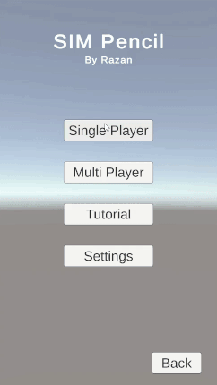

## SIM Game
SIM is a two-player game where players take rounds to highlight with their color lines connecting dots on a hexagon. Whoever forms a triangle with their color first loses the game. This game can't end in a tie.

The game was made using Unity. In single-player mode, the player competes against an AI, whose difficulty can be adjusted, that utilizes a min-max algorithm to make moves.

The game is still a work-in-progress. The single-player functionality is complete, however. Here is a sneak peak of the game play:

